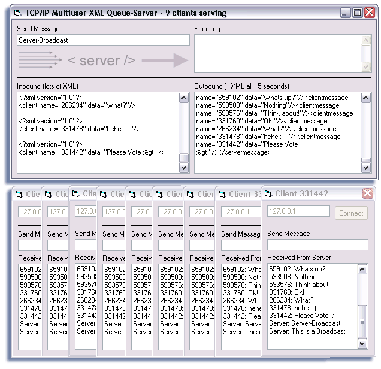



## TCP/IP Multiclient XML Queue\-Server

### Description

Forget the Chat-Only-Servers here on PSC - This is the First Multi-Purpose(!) Multi-Client XML-Queue-Server. How does it work? The client-app sends its "data" as a XML-File over a TCP/IP-Connection to the server. The server grabs this XML-File, and puts/parses all the other Client-XML-Files into one big Server-XML-File. after some seconds, this "complete" file will be sent to the clients - which will parse it back and print the "data" of all the clients. Et Voila. ^^

----

Key Features:

* Works with XML, not strings

* expand the data to send what you want, XML can even tranfer large binary data.

* Up to 65536 clients at one time.

* Less transfer/cpu-time for clients and mainly Server.

* Uses MSXML40 Core Services

* Its an Queue, not an Echo-Server like the other "chat"-Servers out there on PSC. It sends all the Data with one command.

* XML is standard - feed your applications over the Inet with it.

* add "Header"-Info to each server-xml.

* clear and commented code.

----

Bugs:

None (but i'll update if you/I find(s) one.)

----

Votes:

If you think, it's a nice piece of work, vote. If you don't think so, you are probably behind the time :>
 
### More Info
 

             |
---                |---
**Submitted On**   |2002-10-09 17:44:02
**By**             |[Ninnghizidha](https://github.com/Planet-Source-Code/PSCIndex/blob/master/ByAuthor/ninnghizidha.md)
**Level**          |Advanced
**User Rating**    |5.0 (45 globes from 9 users)
**Compatibility**  |VB 5\.0, VB 6\.0
**Category**       |[Complete Applications](https://github.com/Planet-Source-Code/PSCIndex/blob/master/ByCategory/complete-applications__1-27.md)
**World**          |[Visual Basic](https://github.com/Planet-Source-Code/PSCIndex/blob/master/ByWorld/visual-basic.md)
**Archive File**   |[TCP\_IP\_Mul1435271092002\.zip](https://github.com/Planet-Source-Code/ninnghizidha-tcp-ip-multiclient-xml-queue-server__1-39687/archive/master.zip)

